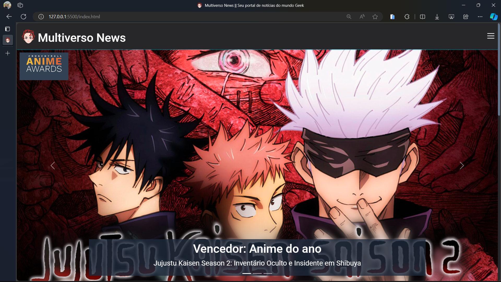

# multiverso-news

## 📖 Sobre a atividade:
Eu, Gustavo Sales, bravo(a) estudante da Guilda de Desenvolvedores Geek, fui convocado(a) para embarcar em uma jornada extraordinária! Minha missão? criar um portal de notícias do mundo geek, onde as histórias do multiverso serão compartilhadas com estilo, paixão e maestria técnica. O portal não só é um local de informação, mas também um refúgio para todos os aventureiros da cultura nerd.

Combinei minhas habilidades em HTML, CSS, SEO e acessibilidade, muito café e aula do grande mestre Gabriel Azevedo para forjar um portal inesquecível!

## 🚀 Tecnologias utilizadas
- HTML5;
- CSS3;
- Javascript;
- <a href="https://www.getbootstrap.com/">Bootstrap</a>;
- <a href="https://michalsnik.github.io/aos/">AOS - Animate On Scroll</a>;

## ⚒️ Funcionalidades do site

- Carrossel de imagens, que mostram os vencedores do Anime Awards 2024;
- Cards de notícia sobre o mundo Geek;
- Possibilidade de navegação entre telas com conteúdo dinâmico;
- Formulário de envio de uma nova notícia, com validação de input;
